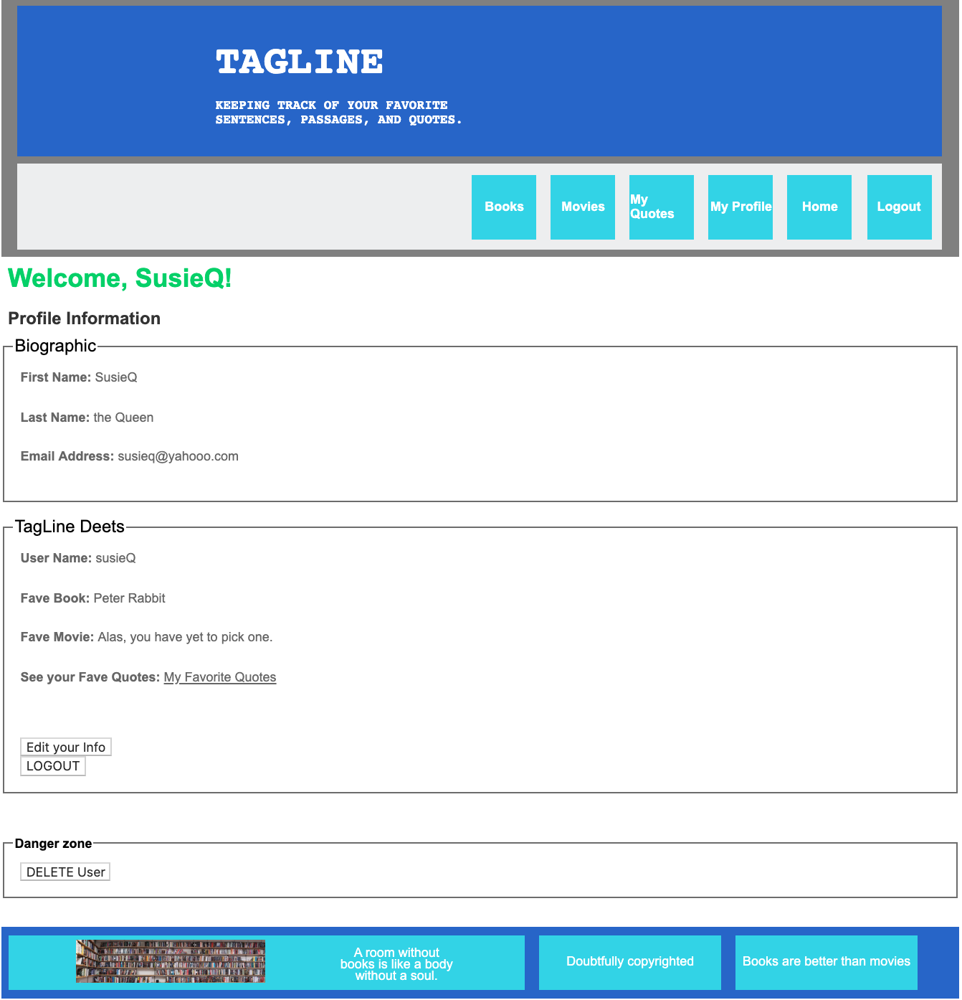

## TagLine Fun Times

TagLine was inspired by my own yearning for some place to store my favorite quotes, sentences, passages, etc. from books I'm reading or movies I've just watched. This web app is a simple one that allows users to store their favorite quotes (from both literary and cinematic works), and browse the favorites of other users.
<br>
Home Screen Preview
<br /> 

<br>

## Installation

 - Clone down this project repository by clicking the green "Clone or download" button above. Copy the SSH link, and open up your computer's Terminal. Inside, type "git clone <the link you've just copied>". This should open up the project: You'll see folders labeled "bin", "config", "db", "lib", etc.

 - Back in your terminal, type "bundle install".
  ```
   bundle install
  ```
 - Then, from the root directory, run "rake db:migrate" to create the database locally.
  ```
   rake db:migrate
  ```
 - Lastly, run "rake db:seed". Now you're ready to go!
  ```
   rake db:seed
  ```

## Running the Application

To open the app, you'll have to start up a local server. In your Terminal, navigate to the TagLine directory (which you've just downloaded from git). Then type "rails s".
 ```
 rails.s
 ```
In your favorite web browser, head to "localhost:3000/" and get to saving your favorite quotes!

## Navigating the Site

When you first enter the site, you will be asked to sign up or login. On your first visit, click on the Sign Up button and follow the given instructions. The next time you visit the site, simply click Log In and enter the information you previously entered. If you don't log in, you'll be able to see a list of books and movies that other folks have entered favorite quotes for. But in order to store your own favorites, you will need to create an account. You can enter new favorite quotes, tag them with various categories, and browse your former entries.

## Preview

Profile Page for Returning User
<br /> 

<br>
List of Quotes
<br /> 

<br>
Adding to Database View
<br /> 

<br>

## Highlights

Two bits of code that were fun/challenging to write -- and which I'd still like to find a better way to implement.

1. I ran into difficulties writing a single form to handle the creation of a quotation - since a quote could belong to either a book or a movie, but not both. The params passed back from the form would be different based on the quote's source, and so it seemed like my code would need to diverge to accommodate the two possibilities. A workaround (that is not the most elegant, and I hope to improve) involved first requiring the user to pick a source.
<br />

<br>
Depending on the selection, they were directed to two different versions of the "New Quote" form.
<br>

<br><br>
2. Slightly more satisfying was my solution to filtering quotations by tag. Writing a class method for Quotes - that would redefine/limit @quotes based on the selected tag - allowed me to render the same index page no matter whether there was a filter or not.
<br />

<br>

## Credits

Thank you to...

... <a href="https://templatemo.com/tm-544-comparto">TemplateMo</a>, which provided a basic CSS template framework.

... Patrick Rothfuss, for use of his <a href="https://blog.patrickrothfuss.com/wp-content/uploads/2017/11/BookWallPanorama-e1510155573613.jpg">library photograph.</a>

... <a href="needpix.com">NeedPix</a>, for <a href="https://storage.needpix.com/rsynced_images/books-2085587_1280.jpg">this</a> beautiful photograph.


## Contributing

Contributions are most welcome. This is very much a beginner project, and constructive criticism is appreciated. Feel free to open a pull request or branch from this project.

## License

This project is licensed under the [GNU GPL](https://www.gnu.org/licenses/gpl-3.0.en.html)

Enjoy.